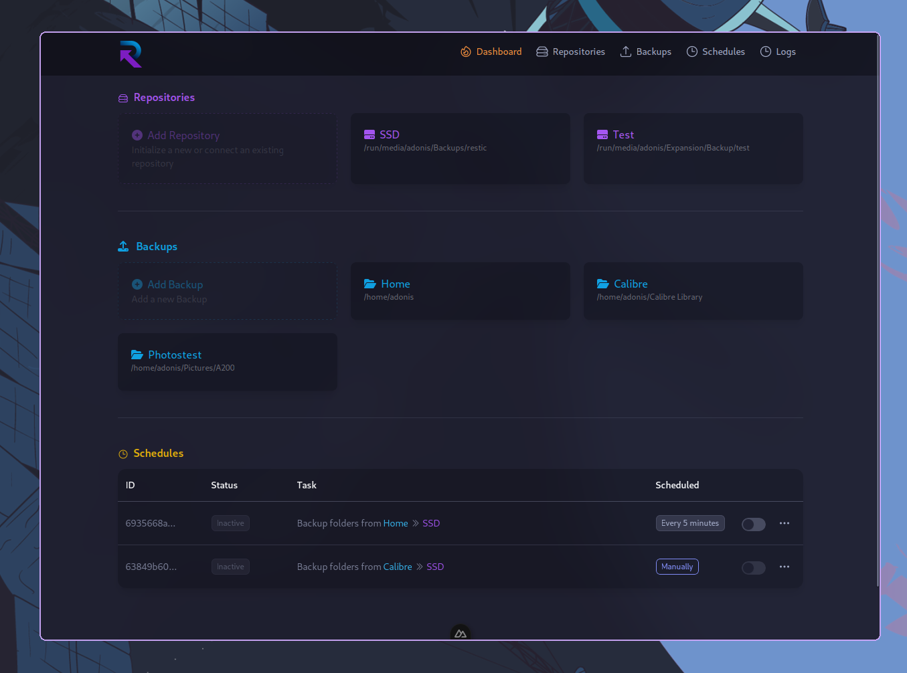

<h1 align="center">
  <br>
  <a href="https://github.com/ad-on-is/resticity"></a>
  <br>
  Resticity
  <br>
</h1>

<h4 align="center">A beautiful cross-platform UI for <a href="https://restic.readthedocs.io/en/stable/" target="_blank">restic</a>, built with <a href="https://wails.io" target="_blank">Wails</a>.</h4>



## Key Features

- Easy to use
- Light/Dark mode
- Cross platform
  - Linux
  - Windows
  - MacOS
- Docker image to run on self-hosted servers
- Scheduled backups
- Supports local and remote repositories
  - Local folder or mounted network drive
  - AWS
  - Backblazez
  - Azure
  - Google
- System tray support
- Desktop Notifications
  - when a schedule starts
  - when a schedule finishes sucessfully or with errors
- Hooks
  - when a schedule starts
  - when a schedule finishes sucessfully or with errors

## How To Use

### Desktop

```bash
# Run in GUI mode
$ resticity

# Run in background mode (useful for autostart)
$ resticity --background

# Run with custom configuration path
$ resticity --config /path/to/config.json
```

### Docker

```bash
# Run within Docker
# Add the paths that you want resticity to grant access to
$ docker run -d --name resticity -p 11278:11278 -v /path/to/config.json:/config.json -v /mnt:/mnt -v /home:/home ghcr.io/ad-on-is/resticity
```

#### Docker compose

```yaml
version: "3"
services:
  reseticity:
  image: ghcr.io/ad-on-is/resticity
  container_name: resticity
  ports:
    - 11278:11278
  volumes:
    - /mnt:/mnt # Add the paths that you want resticity to grant access to
    - /home:/home
    - /path/to/config.json:/config.json
```

## Configuration

Resticity looks for a configuration file in the following order:

1. Custom file location with the `--config path/to/config.json` flag
2. `RESTICITY_SETTINGS_FILE` environment variable
3. `$XDG_CONFIG_HOME/resticity/config.json`

## Troubleshooting

Set `RESTICITY_LOG_LEVEL=debug` as environment variable for detailed debug messages (and log files).

> [!WARNING]  
> This produces larger log files, so it is advised not to run it in production.

## Installation

```bash
# Arch Linux
paru -S resticity
```

## Build yourself

```bash
# Clone this repo
$ git clone https://github.com/ad-on-is/resticity

# Install wails
$ go install github.com/wailsapp/wails/v2/cmd/wails@latest

# cd into resticity
$ cd resticity

# Build using wails
$ wails build
```

## TODOs

- [ ] Packaging for different platforms
- [ ] CI/CD and versioning

---

> [adisdurakovic.com](https://adisdurakovic.com) &nbsp;&middot;&nbsp;
> GitHub [@ad-on-is](https://github.com/ad-on-is)
